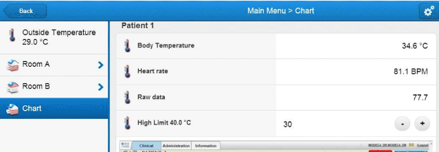

# Optical Wireless Patient Tag and e-Health Record

Currently, radio frequency is used as a way for wireless communication and it has strong mobility. There is some restriction forwireless communication in hospitals or aircrafts. Radio frequency (RF) device will emit electromagnetic interference that canaffect sensitive medical equipment or emergency radio channel. Consequently, low power RF is used at those places.Moreover, there is privacy concern using RF communication due to the radio is free on the air. Everyone can capture the data of radio in the air. The data bandwidth is very limited as everyone can use the radio channel (2.4GHz). It is popular to use optical technology to transmit data, for examples, optical fiber and infrared. For wireless applications, infrared communication could be introduced to transmit data indoor. In this project, the improvement of wireless communication will be implemented by combining the infrared communication standard and microcontroller technology.

## Methodology

- Identifying sensors and its connections with the Arduino UNO microcontroller board
- Data packaging and infrared communication over 3 meters
- Software coding for analyzing and displaying received sensor data

## Screenshots
Figure 1. IR Wireless Patient Tag Integration
[

Figure 2. Design Diagram
[

Figure 3. Software Workflow
[

Figure 4. Hardware Arduino Setup
[

Figure 5. Web UI
[

## License

[GNU General Public License v3.0](https://www.gnu.org/licenses/gpl-3.0.html)